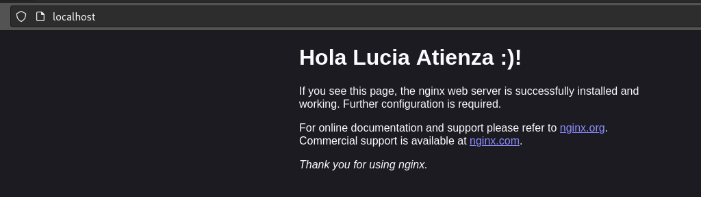
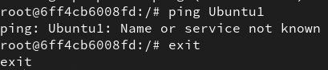
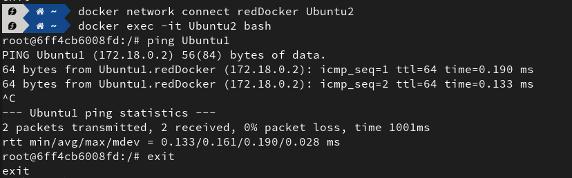

# DOCKER - Práctica 2

### Parte 1

1. Crear volumen compartido `volumenDocker`\
  `docker volume create --name volumenDocker`
2. Crear un contenedor de Nginx que use el volumen `volumenDocker`.\
  `docker run -d -p 80:80 --name nginx1 -v volumenDocker:/usr/share/nginx/html nginx
3. Modifique el contenido del fichero `index.html` incluyendo un saludo personal en lugar del texto por defecto.\
Abrimos una terminal para modificar el contenido del fichero:
`docker exec -it nginx bash`\
Abrimos el fichero con un editor de texto como nano y editamos el contenido.
4. Cree un segundo contenedor que también use el volumen `volumenDocker`.\
`docker run -d -p 81:80 --name nginx2 -v volumenDocker:/usr/share/nginx/html nginx`
5. Compruebe que puede acceder a `localhost:80` (primer contenedor) y `localhost:81` (segundo contenedor) y ver el contenido de `index.html`.

---

### Parte 2

1. Crear una nueva red `redDocker`.\
 `docker network create redDocker`
2. Crear un contenedor de Ubuntu `Ubuntu1`.\
 `docker run -d --name Ubuntu1 -it ubuntu bash`
3. Crear un contenedor de Ubuntu `Ubuntu2`.\
`docker run -d --name Ubuntu2 -it ubuntu bash`
4. Conectar `Ubuntu1` a la red `redDocker`.\
 `docker network connect redDocker Ubuntu1`
5. Intentar hacer ping a `Ubuntu1` desde `Ubuntu2`. ¿Funciona? ¿Por qué?.\
Hacemos `ping Ubuntu1` desde la máquina Ubuntu2, pero no funciona porque Ubuntu2 no está conectado a la red y por lo tanto no reconoce el nombre de Ubuntu1.

6. Conectar `Ubuntu2` a la red `redDocker`.\
 `docker network connect redDocker Ubuntu2`
7. Intentar de nuevo hacer ping a `Ubuntu1` desde `Ubuntu2`. ¿Funciona? ¿Por qué?.\
Ahora sí funciona porque ambas máquinas están dentro de la misma red.

