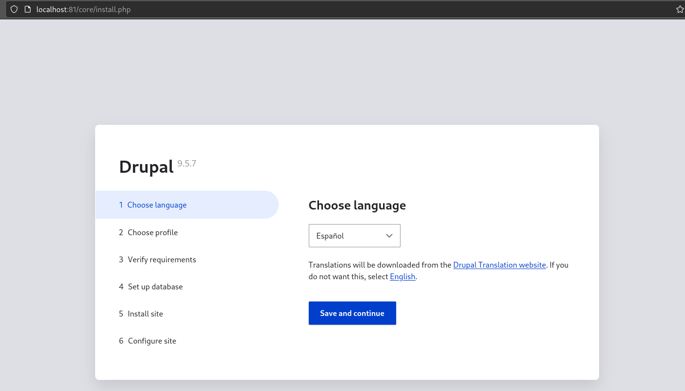

## Practica 3 Docker - Parte 1
Comentarios sobre el `docker-compose.yml`:
- `version: '3'`: especifica la versión de Docker Compose a usar
-  `db` : a partir de aquí especificamos el servicio MySQL
- `image: mysql:5.7 `: imagen de Docker a utilizar
-  `volumen: volumenDocker:/var/lib/mysql` : indicamos que vamos a usar el volumen volumenDocker y que lo vamos a montar en la ruta /var/lib/mysql.
- Definimos varias variables de entorno para el contenedor, como la contraseña de root, nombre de la base de datos, usuario y contraseña.
-  `image: drupal:9-apache`: especificamos la imagen a usar
- `81:80`: usamos el puerto 81 del host para el puerto 80 del contenedor
- Definimos también variables de entorno para el contenedor, como el nombre del host de la base de datos Drupal, nombre de la base de datos, usuario y contraseña.

Finalmente,previsualizamos la configuración de drupal accediendo a `localhost:81`:

