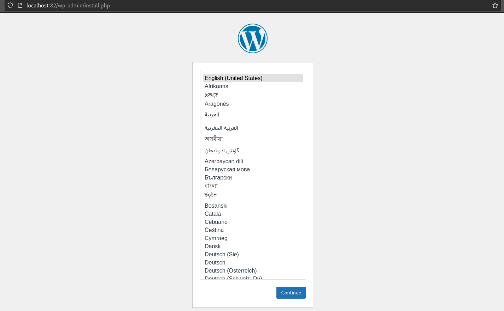

## Práctica 3 Docker - Parte 2
Definimos dos servicios: un servicio de base de datos MariaDB llamado "db" y un servicio de WordPress llamado "wordpress".
El servicio de base de datos se inicia a partir de la imagen de MariaDB. Se configura una contraseña para el usuario raíz y se crea una base de datos de WordPress con un usuario y contraseña.
```
db:
    image: mariadb
    command: --transaction-isolation=READ-COMMITTED --binlog-format=ROW
    restart: always
    environment:
      MYSQL_ROOT_PASSWORD: example
      MYSQL_DATABASE: wordpress
      MYSQL_USER: wordpress
      MYSQL_PASSWORD: example
    networks:
      - redDocker
```
El servicio de WordPress depende del servicio de base de datos configurado en el apartado anterior. El servicio de WordPress se inicia a partir de la imagen de WordPress y se configura para que se ejecute en el puerto 82 del host. Se especifican las variables de entorno de WordPress para configurar la conexión a la base de datos. Estos valores coinciden con los valores definidos para la base de datos en el servicio de la base de datos.
```
wordpress:
    depends_on:
      - db
    image: wordpress
    ports:
      - "82:80"
    environment:
      - APACHE_SERVER_NAME=localhost
    restart: always
    environment:
      WORDPRESS_DB_HOST: db
      WORDPRESS_DB_USER: wordpress
      WORDPRESS_DB_PASSWORD: example
      WORDPRESS_DB_NAME: wordpress
    networks:
      - redDocker
```
Se hace uso de la red redDocker para conectar ambos servicios.
Previsualizamos accediendo a `localhost:82`:

